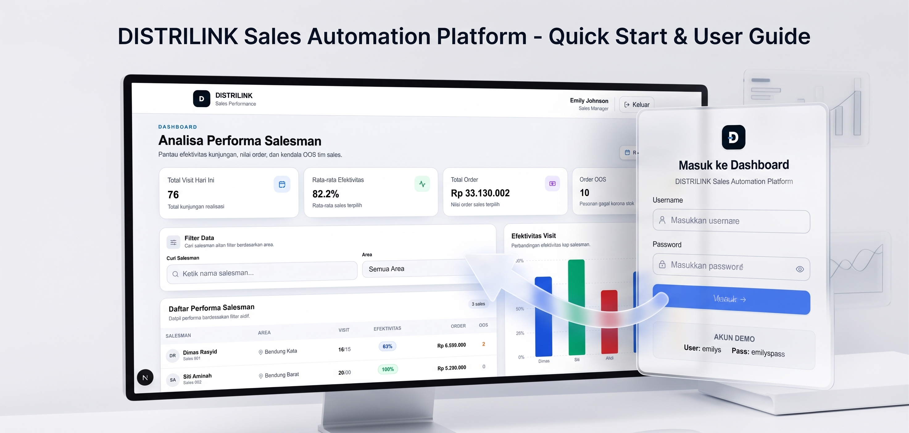

# DISTRILINK — Sales Performance Dashboard

Dashboard analisa performa salesman: login, summary metrik, tabel, chart, search & filter.



## Tech Stack

- Next.js (App Router) + TypeScript
- Tailwind CSS
- Recharts (chart)
- Lucide React (icon)
- DummyJSON (API login)

## Requirements

- Node.js (versi sesuai kompatibilitas Next.js pada `package.json`)
- npm
- Git

## Instalasi

```bash
git clone https://github.com/rayhan204/Distrilink-SAP.git
cd Distrilink-SAP
npm install
```

## Menjalankan

```bash
npm run dev
```

Buka `http://localhost:3000`. Tekan `Ctrl + C` untuk menghentikan server.

## Akun Demo

```
Username: emilys
Password: emilyspass
```

Login diproses lewat API route internal `/api/login`, yang meneruskan request ke `https://dummyjson.com/auth/login`. Session user disimpan di `localStorage` (key: `distrilink_auth`).

## Scripts

| Command | Keterangan |
|---|---|
| `npm run dev` | Jalankan development server |
| `npm run lint` | Cek lint |
| `npm run build` | Build production |
| `npm run start` | Jalankan hasil build |

## Struktur Project

```
src/
├── app/            # routing, page, API route (app/api/login)
├── components/     # UI component per tanggung jawab
├── hooks/          # useAuthUser (baca session)
├── lib/            # auth.ts, constants.ts, utils.ts
├── services/       # auth.service.ts (komunikasi API login)
├── types/          # kontrak data TypeScript
└── data/sales.json # dataset performa salesman (mock)
```

## Dataset

Data performa salesman berasal dari `src/data/sales.json` (data statis, bukan dari API publik). Field utama: `nama_sales`, `area`, `kunjungan_planned`, `kunjungan_realisasi`, `efektivitas_visit_persen`, `total_order_rp`, `jumlah_order_oos`.

---

## Production Improvement

Jika project dikembangkan lebih lanjut menjadi aplikasi production, beberapa improvement yang dapat dilakukan:

- Menggunakan backend/database untuk data performa.
- Menggunakan secure HttpOnly cookie untuk authentication session.
- Menambahkan role-based access control.
- Menambahkan pagination pada tabel ketika data besar.
- Menambahkan server-side filtering.
- Menambahkan unit test dan integration test.
- Menambahkan error monitoring.
- Menambahkan API schema validation.
- Menambahkan loading skeleton.
- Menambahkan empty state yang lebih detail.
- Menambahkan export laporan.
- Menambahkan date range untuk analisis historis.
- Menambahkan target KPI supervisor.

Improvement tersebut sengaja tidak dibuat sebagai bagian utama prototype agar scope tetap sesuai kebutuhan assessment dan tidak menjadi over-engineering.

---

**Rayhan** — Frontend Web Test Case, DISTRILINK
